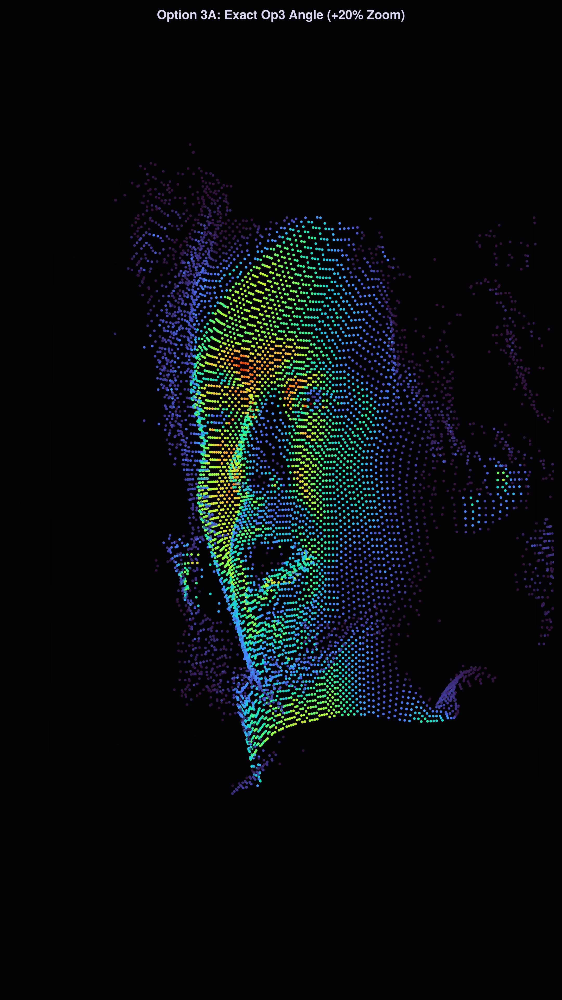
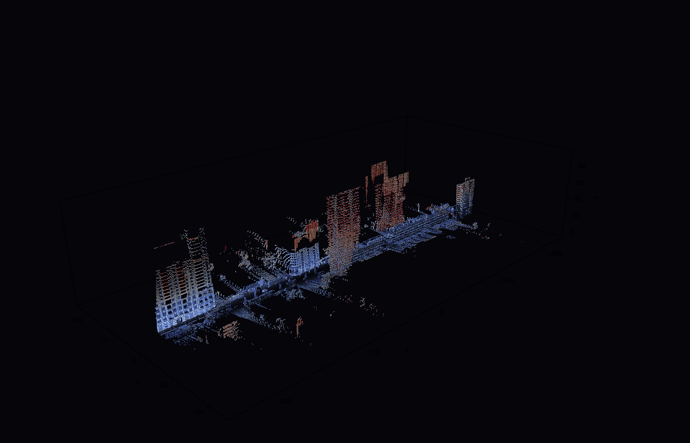
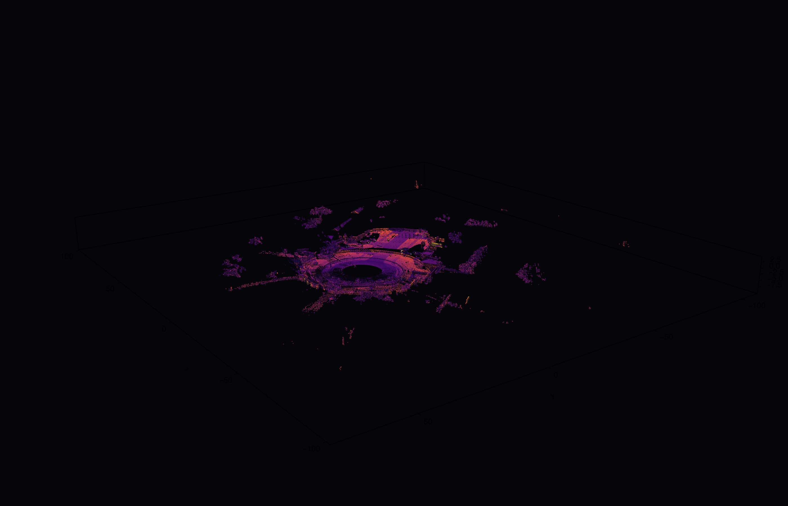

# RADIOHEAD / HOUSE OF CARDS – 3D Point Cloud Studio

A modern high-performance 3D visualization and video rendering suite in **Julia** for the open-source dataset from Radiohead's groundbreaking [House of Cards](https://www.youtube.com/watch?v=8nTFjVm9sTQ) (2008) music video, created entirely without physical cameras using 3D structured-light optical scanning and 360-degree LiDAR rangefinders.

---

## Visual Previews

| Thom Yorke (3D Facial Point Cloud) | City 360° LiDAR Scan | Cul-de-sac LiDAR Environment |
| :---: | :---: | :---: |
|  |  |  |

---

## Quickstart

### 1. Launch the Interactive 3D Studio
```bash
julia --project=. run_viewer.jl
```
Explore 2,101 frames of Thom Yorke's performance, scrub through the timeline, switch between LiDAR scans, and tweak real-time colormaps and noise filters.

### 2. Render 30 FPS MP4 Video (with Synced Audio)
```bash
julia --project=. export_video.jl
```
Renders the full sequence with customizable camera orbit, perspective depth, and automatic FFmpeg audio synchronization driven by [`render_config.toml`](render_config.toml).

---

## Documentation

For full setup instructions, TOML configuration parameters, and TouchDesigner pipelines:

**[Read the Complete Technical Guide (docs/GUIDE.md)](docs/GUIDE.md)**

---

## AI-Assisted Development Note

This Julia 3D Studio, high-speed data loader, video export engine, and TouchDesigner integration were developed using **Gemini 3.7 Flash** (Google DeepMind) in pair-programming collaboration with Carlo Monjaraz as an exploratory case study in modernizing legacy creative coding datasets.

---

## Credits & License

* **Music Video**: Radiohead – *House of Cards* (2008), directed by James Frost.
* **Technical Direction**: [Aaron Koblin](http://www.aaronkoblin.com).
* **Data License**: [CC BY-NC-SA 3.0](https://creativecommons.org/licenses/by-nc-sa/3.0/) (Copyright 2008 Radiohead).
* **Code License**: [Apache License 2.0](LICENSE) (Copyright 2026 Carlo Monjaraz & Contributors).
